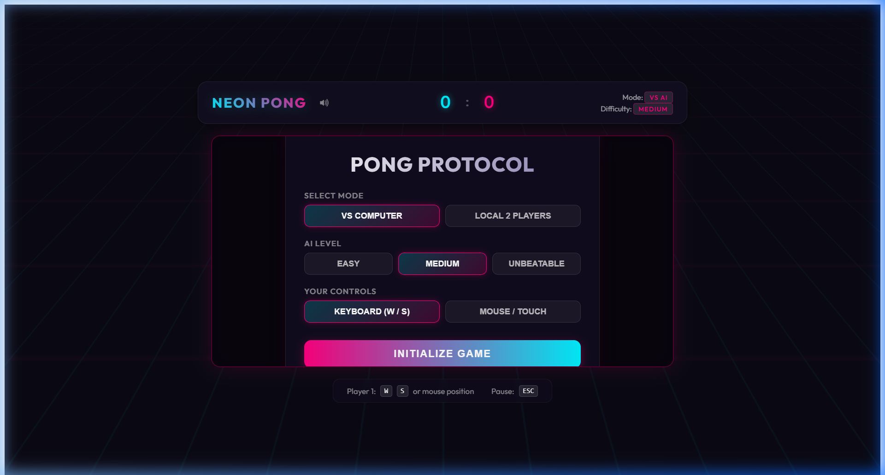
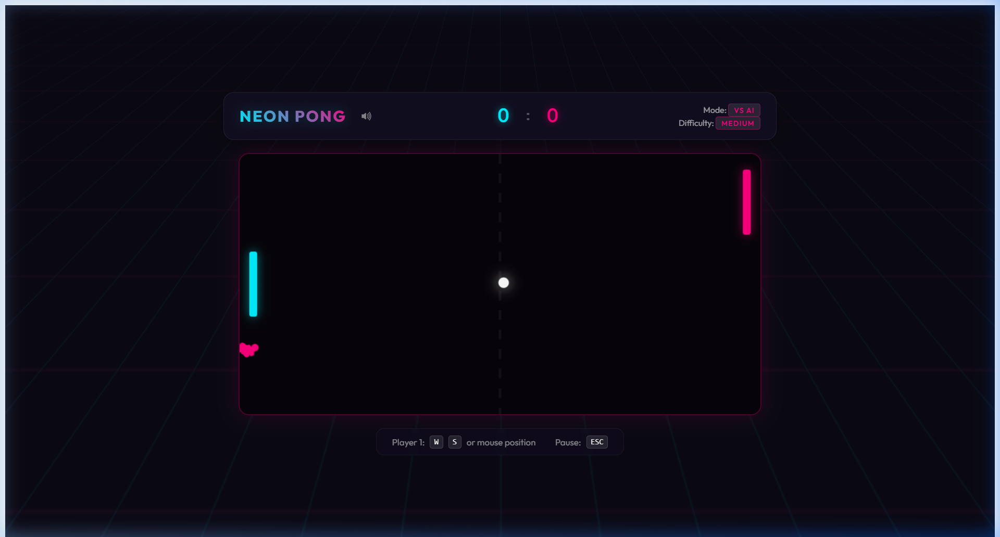
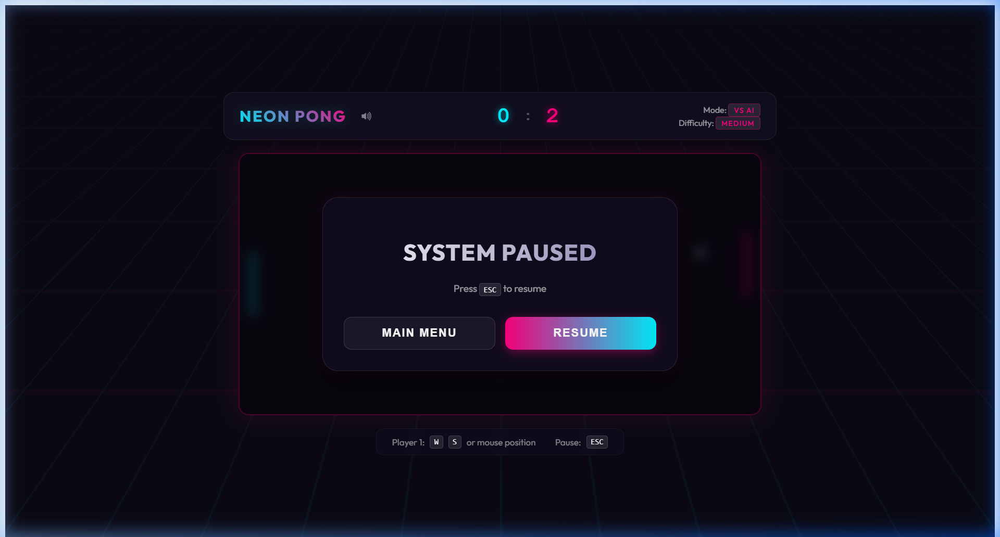

# 🎮 Cyberpunk Neon Pong (Angular 17+)

A classic Ping Pong game reimagined with a high-fidelity **Cyberpunk / Synthwave** aesthetic. Built as a strongly-typed, standalone **Angular (v17+)** component.

## 📸 Screenshots

### Start Screen


### Active Gameplay


### Pause Menu


---

## ⚡ Features

- **Standalone Component Architecture**: Easily drop the `<app-ping-pong>` element into any Angular 17+ component.
- **Web Audio API Synth Engine**: Play synthesized 8-bit retro sound effects (paddle bounces, wall pops, score melodies) on the fly without needing external `.mp3` assets.
- **Neon Particle System**: Real-time particle explosions trigger upon paddle collisions and when a player scores.
- **Game Modes**:
  - **VS Computer**: Challenge the integrated tracking AI with selectable difficulty settings (**Easy**, **Medium**, or **Unbeatable**).
  - **Local 2-Player**: Play side-by-side with a friend.
- **Dynamic Control Schemes**:
  - **Keyboard Controls** (W/S for Left, Up/Down arrow keys for Right).
  - **Mouse & Touch Support** (Paddle follows the vertical position of mouse cursor or touch swipe).
- **Proper Lifecycle Management**: Safely halts and cancels animation frame cycles in `ngOnDestroy` to prevent memory leaks.

---

## 🚀 How to Run Locally

### Prerequisites
Make sure you have [Node.js](https://nodejs.org/) installed.

### 1. Install Dependencies
Navigate to the root workspace directory and install packages:
```bash
npm install
```

### 2. Start the Development Server
Launch the local server:
```bash
npm run start
```

### 3. Open the Game
Open your web browser and navigate to:
[http://localhost:4200/](http://localhost:4200/)

---

## 🎮 Game Controls

| Action | Player 1 (Left Paddle) | Player 2 (Right Paddle) |
| :--- | :--- | :--- |
| **Move Up** | <kbd>W</kbd> / Move Mouse Up | <kbd>▲</kbd> Arrow Up |
| **Move Down** | <kbd>S</kbd> / Move Mouse Down | <kbd>▼</kbd> Arrow Down |
| **Pause/Resume** | <kbd>ESC</kbd> | <kbd>ESC</kbd> |
| **Mute Sound** | Sound Toggle button in HUD | - |

---

## 🛠️ Tech Stack & Design
- **Core Framework**: Angular (v17.x Standalone Components)
- **Rendering**: HTML5 Canvas Rendering Context 2D
- **Aesthetics**: Vanilla CSS3, Grid animations, Glassmorphism panels, and Backdrop blur filters
- **Audio**: Web Audio API (OscillatorNode, GainNode, ExponentialDecay curves)
